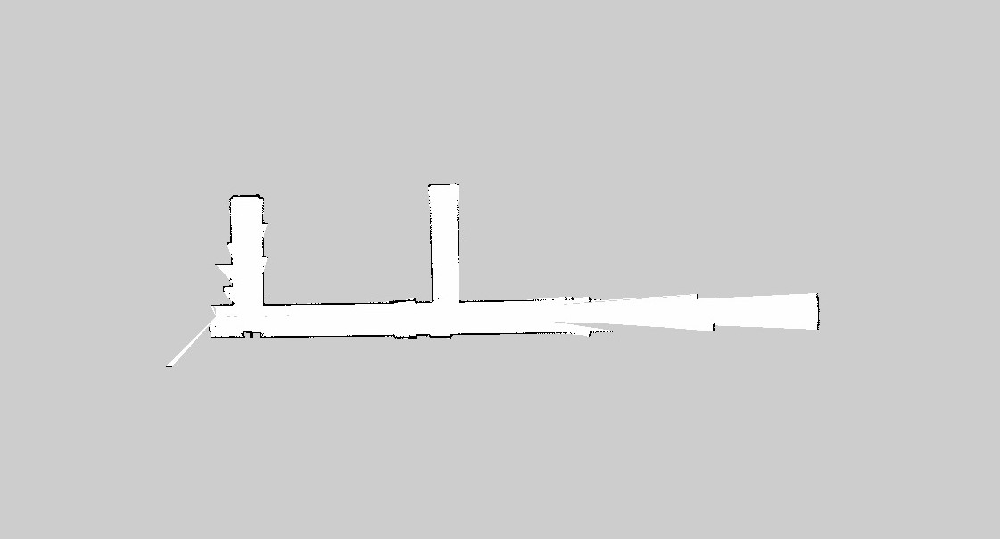

# map_follower
The `map_follower` is a ROS package for autonomous navigation and control of an ackermann steered race car. The software takes 2D lidar data and IMU to localise itself on a given map and race along a predefined trajectory. </br></br>
The software is tested on UBUNTU 16.04 with ROS Kinetic.

## Compiling
The software is a standard catkin package. Make sure the package is on `ROS_PACKAGE_PATH` after cloning the package to your workspace.
```
cd your_work_space
catkin_make
```
## Hardware Specifications
The hardware used to development of this package is a 1/10th scaled rally racing car. It comprises of Nvidia Jetson and the main computer and Arduino UNO as the lowlevel controller. The car uses a Hukoyu 2D lidar and an 6DOF IMU. 
## Control Algorithm
### Tracking
The control can be divide into two main parts localization and navigation. The code uses Adaptive Monte Carlo Localization(AMCL), this though very accurate runs at approximately 4Hz and its reliability is heavily dependent on availability of distinct features.
For continous tracking of the vehicle we combine this with model predicition and IMU.</br>
Model prediction uses the acceleration and velocity model to estimate its position and IMU uses double integrator. Both these run at 150Hz.
For tracking all there values are fused.</br>
### Control
The code consists of two PD control loops which run at 150Hz. The setpoint for both these loops in the waypoint in consideration. The waypoint in consideration is updated from the CSV file at 1.2 Hz. the first control loop control the forward velocity acting based in how far the waypoint is(x-direction) and the second control loop controls the steering angle depending on the y error.
### Tranforming waypoints
The waypoints marked by the user are in `map_frame` and the IMU readings obtained are in `car_frame`, we thus transform the "waypoint in consideration" as per the location of the car. This makes it easier to fuse the IMU values.
## Tuning PD parameters
### [Ackermann Simulator](https://github.com/manav20/Control-Systems/blob/master/Ackermann_Simulator.m) 
The above is a matlab script which simulates a PD controlled ackermann steered vehicle. This script can be used to understand and visualize how and which paramters to change.
## Example 1 - Hallway
### 1. Configure map_server
Upload `hallmap.pgm` and `hallmap.yaml` in the resource folder. </br>
Update `hallmap.launch` with the address of `hallmap.yaml` file.

<!-- insert map picture -->
### 2. Mark waypoints
Launch map
```
roslaunch map_follower hallmap.launch 
```
<!---  --->
Run the waypoint.py for waypoint generation.
```
rosrun map_follower waypoint.py
```
This script allows the user to use rviz for selecting waypoints, visualize the path and save the waypoints in a CSV file.
<!-- insert rviz picture  -->
### 3. Run the code
In a new terminal execute the run.py file
```
rosrun map_follower run.py
```

